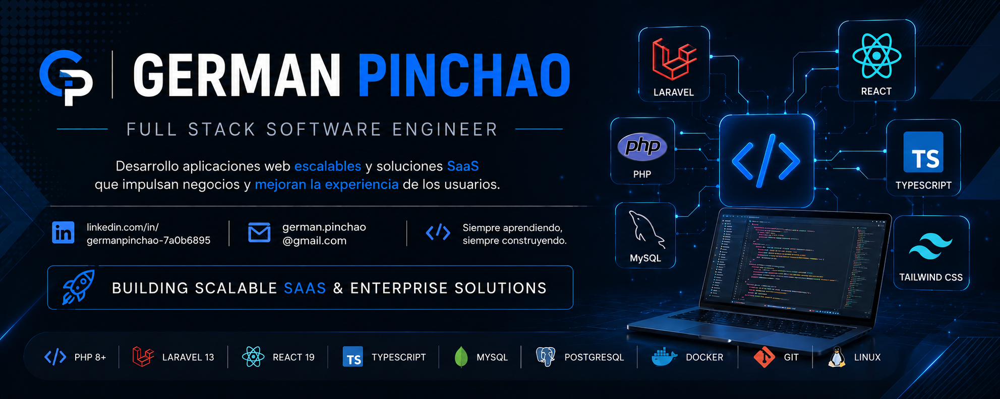

  

# Hola, soy German Pinchao

### Full Stack Software Engineer | Laravel • React • TypeScript • PHP

Soy Ingeniero de Sistemas y desarrollador Full Stack apasionado por crear soluciones tecnológicas que generen valor para las empresas. Cuento con experiencia en el diseño, desarrollo e implementación de aplicaciones web, plataformas SaaS y sistemas empresariales, participando en todas las etapas del ciclo de vida del software.

Mi experiencia se centra en el desarrollo con **Laravel, React, TypeScript, PHP y MySQL**, construyendo arquitecturas escalables, APIs REST, sistemas Multi-Tenant e integraciones con servicios externos.

Actualmente desarrollo soluciones para los sectores **inmobiliario, hotelero, comercial y empresarial**, siempre con el objetivo de automatizar procesos, optimizar la operación y ofrecer una excelente experiencia de usuario.

### Contacto

 <a href="https://www.linkedin.com/in/german-pinchao-7a0b6895" target="_blank">LinkedIn</a> · <a href="mailto:german.pinchao@gmail.com" target="_blank">german.pinchao@gmail.com</a> · <a href="https://wa.me/573155938379" target="_blank">WhatsApp</a> 

##  Lo que hago

-  Desarrollo aplicaciones web modernas y escalables.
-  Diseño y desarrollo plataformas SaaS.
-  Construyo APIs REST seguras y de alto rendimiento.
-  Diseño bases de datos relacionales y arquitecturas Multi-Tenant.
-  Desarrollo interfaces modernas con React y TypeScript.
-  Optimizo procesos mediante automatización y soluciones empresariales.
-  Integro aplicaciones con servicios y APIs de terceros.
-  Acompaño proyectos desde el análisis hasta el despliegue en producción.

## Tecnologías y herramientas

### Backend

  

### Frontend

  

### Bases de datos

  

### DevOps y herramientas

  

### Arquitectura y experiencia
- 🔹 APIs REST
- 🔹 Arquitectura Multi-Tenant
- 🔹 SaaS
- 🔹 Autenticación y autorización
- 🔹 Dashboards y reportes
- 🔹 Integración con servicios externos
- 🔹 Facturación electrónica
- 🔹 Optimización de bases de datos
- 🔹 Laravel + React + TypeScript

##  Proyectos destacados

<table>
<tr>
<td width="50%">

### LOPI

**Plataforma SaaS para administración inmobiliaria**

- Arquitectura Multi-Tenant
- Cobros recurrentes
- Estados de cuenta
- Recibos de pago
- Dashboard financiero
- Notificaciones por WhatsApp y correo
- Laravel 13 + React 19 + TypeScript

</td>
<td width="50%">

###  SAHO

**Sistema integral de gestión hotelera**

- Reservas
- Check-in / Check-out
- Caja y pagos
- Consumos
- Calendario interactivo
- Facturación electrónica
- Laravel + React + MySQL

</td>
</tr>

<tr>
<td width="50%">

###  Sistema de Inventarios

**Gestión comercial y de inventario**

- Compras y ventas
- Control de stock
- Reportes de utilidad
- Clientes y proveedores
- Laravel + MySQL

</td>
<td width="50%">

###  Facturación Electrónica

**Integración y automatización de emisión electrónica**

- Generación XML
- Firma digital
- Envío a servicios externos
- Generación PDF
- Laravel + APIs

</td>
</tr>
</table>

